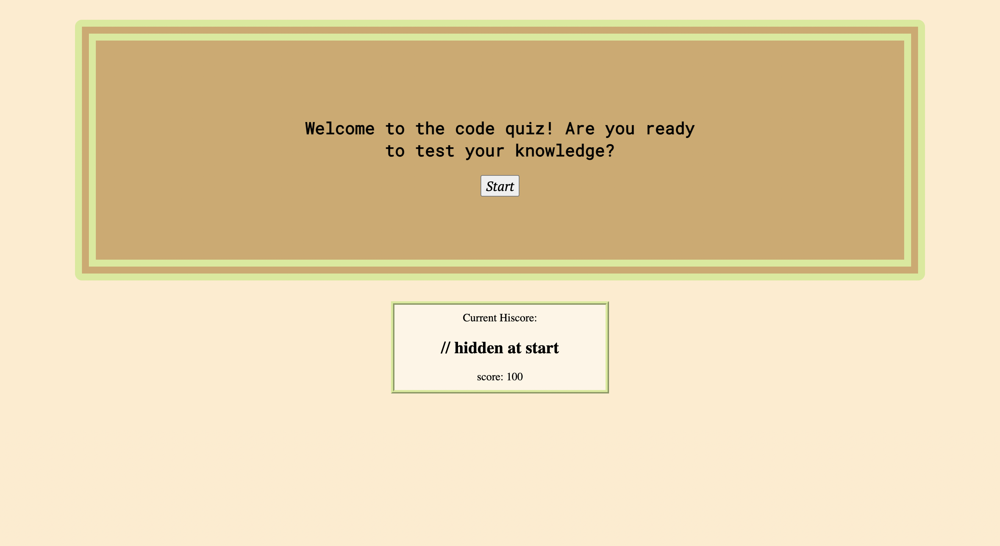
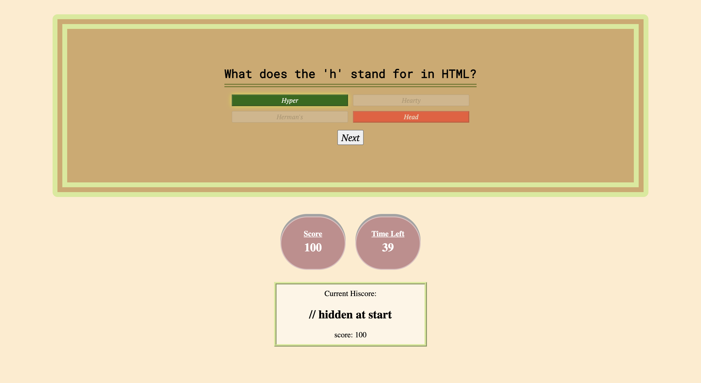

# Forest Wilson - Homework 4 - Code Quiz
MIT - (https://opensource.org/licenses/MIT) - For Good.
<!-- Original deployment date: March 18th, 2021 -->

## Table of Contents:
- [This week's concepts](#this-weeks-concepts)
- [Tech used](#tech-used)
- [Project description](#project-description)
- [Usage instructions](#usage-instructions)
- [Project installation](#project-installation)
- [Additional comments](#additional-comments)
- [Contribution information](#contribution-information)
- [Questions](#questions-or-concerns)
- [Extras](#extras)

### About This Project

* # This weeks concepts:
  1. Local storage
  2. Conditional statements
  3. JS interval/timeout
  4. Array objects

* # Tech used:
  1. HTML
  2. CSS
  3. JavaScript

* # Project description:
  Given a desire to test my coding knowledge, I created an app to quiz myself about coding topics using multiple-choice questions. You may also try and get the best score possible with an implemented hi-score feature. Please pretend that these questions are challenging and furthermore NO PEEKING!

* # Usage instructions
  Test your coding knowledge

* # Project installation
  1. Visit the deployment link
  2. Press start to begin quiz
  3. Enjoy. 
     
* # Additional comments
(Mar/18/21)

  - Writing out the JS to this one took much longer than I thought it would be so there were some visual aspects that I wanted to include such as indicators telling you you're correct and a more descriptive end screen if you did not win or get highscore, but I'm happy with how the looks work in this application.

  - I know that one of the critera of the homework was to be able to implement a leaderboard to which you can add your highscore + name to, but I had an issue figuring out how to submit the same type of data in the local storage but under different names, or rather storing more than one highscore without deleting another. I decided to just opt for a display highscore feature that will store and show the current highscore. If your score is higher than that it will replace the value, but if it is lower in value it does not replace.

  - Would have also liked to add a value in the highscore object that displays time left when you submitted your highscore, but I'll have to save that for the future.

  <!-- note to self: do not use highscore as an attribute, especially if you cant spell. You will have a bad time. -->

#### Contribution information 

- If you would like to contribute to this project, please follow best practices and message me at one of the provided contacts bellow if you want to push!

###### Questions or concerns? 
* Please contact me at one of the following!

  Email - Hexaforest@gmail.com
  gitHub - https://github.com/ForestW70/

# Extras

* Screenshots:
  - 
  - 

* Links:
  - [Repo page](https://github.com/ForestW70/hw4codequiz)
  - [Deployed page](https://forestw70.github.io/hw4codequiz/)